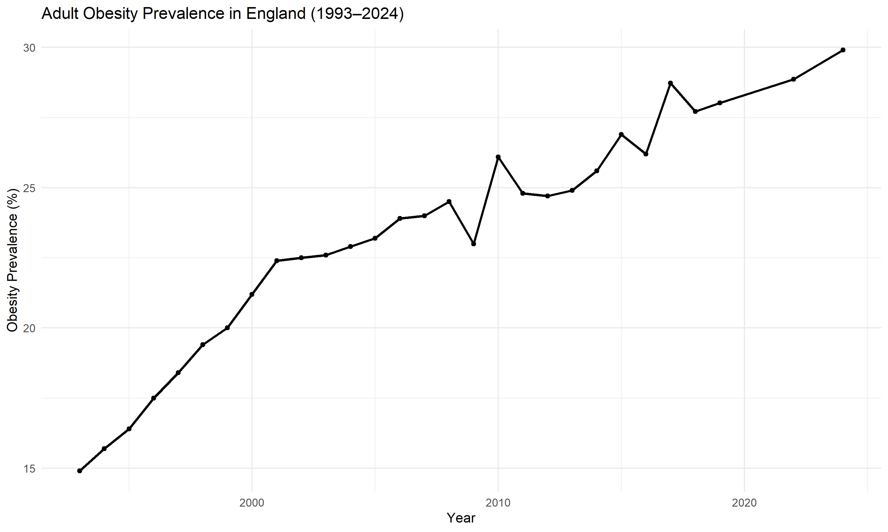

# Project 16: Trends in Adult Obesity Prevalence in England (1993–2024)

## Overview

This project explores long-term trends in adult obesity prevalence in England using national public health surveillance data.

The aim was to examine how obesity prevalence has changed over time and to quantify the scale of change between 1993 and 2024.

---

## Research Question

**How has adult obesity prevalence changed in England between 1993 and 2024?**

---

## Data Source

* Office for Health Improvement and Disparities (OHID)
* Fingertips Public Health Profiles
* Indicator: Obesity prevalence in adults (18+ years)
* Geography: England
* Years: 1993–2024

---

## Methods

The analysis included:

* Data cleaning and preparation
* Descriptive statistics
* Trend analysis
* Time-series visualisation using `ggplot2`

### Software

* R
* dplyr
* ggplot2
* readxl

---

## Results

### Descriptive Statistics

| Statistic          | Value |
| ------------------ | ----- |
| Mean               | 23.3% |
| Median             | 23.9% |
| Standard Deviation | 4.03  |

### Change Over Time

| Measure           | Value                  |
| ----------------- | ---------------------- |
| 1993 Prevalence   | 14.9%                  |
| 2024 Prevalence   | 29.9%                  |
| Absolute Increase | 15.0 percentage points |
| Relative Increase | 100.7%                 |

### Key Finding

Adult obesity prevalence increased from **14.9% in 1993** to **29.9% in 2024**, representing an increase of approximately **15 percentage points** and a **100.7% relative increase**.

---

## Figure

**Figure 1.** Adult obesity prevalence in England between 1993 and 2024.

---

## Key Findings

* Adult obesity prevalence approximately doubled between 1993 and 2024.
* The overall trend was consistently upward despite minor fluctuations.
* The highest prevalence was observed in 2024 (29.9%).
* The lowest prevalence was observed in 1993 (14.9%).
* Findings indicate a growing burden of obesity within the English population.

---

## Public Health Relevance

Obesity is a major risk factor for:

* Type 2 diabetes
* Cardiovascular disease
* Hypertension
* Stroke
* Certain cancers

Monitoring obesity trends helps inform prevention strategies and public health policy.

---

## Limitations

* Descriptive analysis only.
* National-level data were examined.
* Regional and demographic differences were not explored.

---

## Conclusion

Adult obesity prevalence in England increased substantially between 1993 and 2024, highlighting the continuing importance of obesity prevention and population health interventions.
