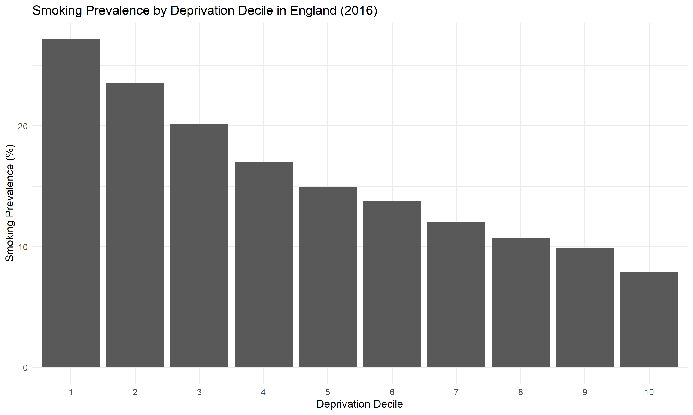

# Project 17: Socioeconomic Inequalities in Smoking Prevalence in England (2016)

## Overview

This project explores socioeconomic inequalities in smoking prevalence across deprivation deciles in England using national public health data.

Smoking is a major risk factor for cardiovascular disease, respiratory disease, cancer, and premature mortality. Understanding how smoking prevalence varies across socioeconomic groups can help identify health inequalities and inform public health interventions.

---

## Research Question

**How does smoking prevalence vary across deprivation deciles in England?**

---

## Data Source

* Office for National Statistics (ONS)
* Adult Smoking Habits in Great Britain
* England
* Year: 2016
* Measure: Current Smoking Prevalence (%)
* Population: Adults aged 18 years and over

---

## Methods

The analysis included:

* Data cleaning and preparation
* Extraction of smoking prevalence estimates by deprivation decile
* Comparison of smoking prevalence across socioeconomic groups
* Bar chart visualisation using ggplot2

### Software

* R
* dplyr
* tidyr
* ggplot2
* readxl

---

## Results

### Smoking Prevalence by Deprivation Decile

| Measure               | Value                  |
| --------------------- | ---------------------- |
| Most Deprived Decile  | 27.2%                  |
| Least Deprived Decile | 7.9%                   |
| Absolute Difference   | 19.3 percentage points |
| Prevalence Ratio      | 3.44                   |

### Key Finding

Smoking prevalence was highest among the most deprived populations and decreased steadily across less deprived groups.

Adults living in the most deprived decile had a smoking prevalence of **27.2%**, compared with **7.9%** in the least deprived decile.

Smoking prevalence in the most deprived decile was approximately **3.4 times higher** than in the least deprived decile.

---

## Figure

**Figure 1.** Smoking prevalence by deprivation decile in England (2016). Smoking prevalence was highest in the most deprived decile (27.2%) and lowest in the least deprived decile (7.9%). A clear socioeconomic gradient was observed, with smoking prevalence decreasing steadily as deprivation decreased.

---

## Key Findings

* Smoking prevalence was highest in the most deprived populations.
* Smoking prevalence decreased progressively across deprivation deciles.
* A strong socioeconomic gradient was observed.
* The inequality gap between the most and least deprived groups was 19.3 percentage points.
* Smoking prevalence in the most deprived group was approximately 3.4 times higher than in the least deprived group.

---

## Public Health Relevance

Smoking remains one of the leading preventable causes of illness and premature death.

The findings demonstrate how smoking is unequally distributed across society and highlight the importance of targeted tobacco control policies and interventions aimed at reducing health inequalities.

Reducing smoking prevalence in deprived populations may contribute to improvements in population health and reductions in health inequalities.

---

## Limitations

* The analysis is descriptive and does not establish causality.
* Only one year of data was examined.
* Individual-level risk factors were not explored.
* Other socioeconomic measures were not considered.

---

## Conclusion

Substantial socioeconomic inequalities in smoking prevalence were observed across England in 2016. Smoking prevalence was considerably higher among the most deprived populations and decreased steadily across less deprived groups.

These findings highlight the importance of addressing the social determinants of health and reducing inequalities in smoking-related harm.
