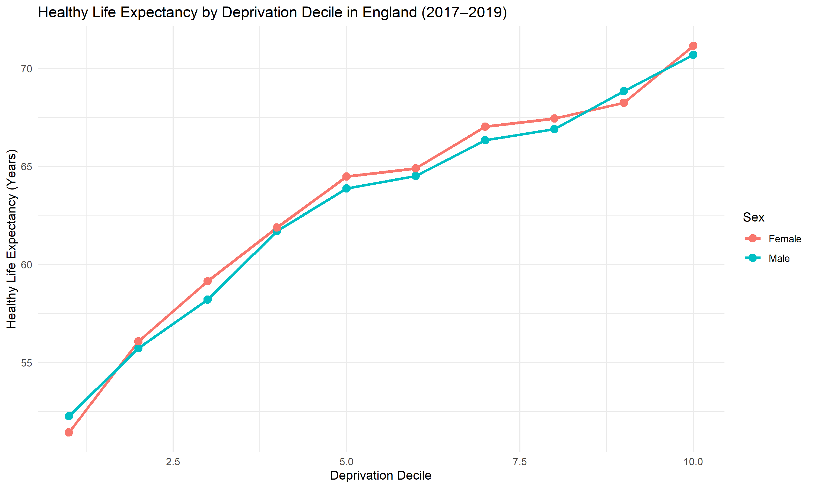

# Project 18: Healthy Life Expectancy Inequalities by Deprivation in England

## Overview

This project explores socioeconomic inequalities in healthy life expectancy across deprivation deciles in England.

Healthy Life Expectancy (HLE) measures the average number of years a person can expect to live in good health. Examining HLE across deprivation groups helps identify inequalities in both health outcomes and quality of life.

----

## Research Question

**How does healthy life expectancy vary across deprivation deciles in England?**

---

## Data Source

- Office for National Statistics (ONS)
- Dataset: Life Expectancy and Healthy Life Expectancy by Index of Multiple Deprivation
- Geography: England
- Period used: 2017–2019
- Population: Male and Female
- Measure: Healthy Life Expectancy at birth

---

## Methods

The analysis included:

- Data cleaning and preparation
- Filtering to healthy life expectancy at birth
- Selection of the most recent period available
- Comparison of HLE across deprivation deciles
- Stratification by sex
- Line chart visualisation using `ggplot2`

### Software

- R
- dplyr
- ggplot2
- readxl

---

## Results

### Healthy Life Expectancy Gap

| Sex | Most Deprived Decile | Least Deprived Decile | Gap |
|------|----------------------|------------------------|------|
| Male | 52.3 years | 70.7 years | 18.4 years |
| Female | 51.4 years | 71.2 years | 19.7 years |

### Key Finding

Healthy life expectancy increased steadily across deprivation deciles for both males and females.

Men in the least deprived decile could expect to live **18.4 more years in good health** than men in the most deprived decile.

Women in the least deprived decile could expect to live **19.7 more years in good health** than women in the most deprived decile.

---

## Figure

**Figure 1.** Healthy life expectancy by deprivation decile in England, 2017–2019. Healthy life expectancy increased progressively as deprivation decreased for both males and females.

---

## Key Findings

- Healthy life expectancy was lowest in the most deprived decile.
- Healthy life expectancy was highest in the least deprived decile.
- A clear socioeconomic gradient was observed.
- The deprivation gap was 18.4 years for males.
- The deprivation gap was 19.7 years for females.
- The pattern was similar for both sexes.

---

## Public Health Relevance

Healthy life expectancy reflects both length of life and quality of life.

Large differences in HLE across deprivation groups suggest that people living in more deprived areas spend fewer years in good health. These inequalities may reflect differences in income, employment, housing, education, health behaviours, healthcare access, and wider social determinants of health.

Understanding these inequalities can support targeted public health interventions and inform policies aimed at reducing health disparities.

---

## Limitations

- The analysis is descriptive and does not establish causality.
- Data were analysed at deprivation-decile level rather than individual level.
- Only healthy life expectancy at birth was examined.
- Other explanatory factors were not included in the analysis.

---

## Conclusion

Healthy life expectancy varied substantially across deprivation deciles in England. People in the least deprived deciles experienced considerably more years in good health than those in the most deprived deciles.

The findings highlight substantial socioeconomic inequalities in healthy life expectancy and demonstrate the value of deprivation-based analysis in public health intelligence.
